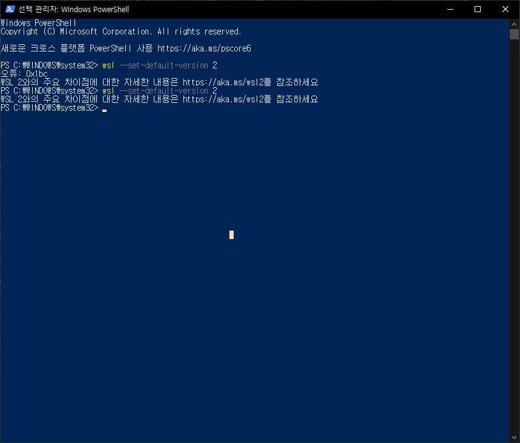
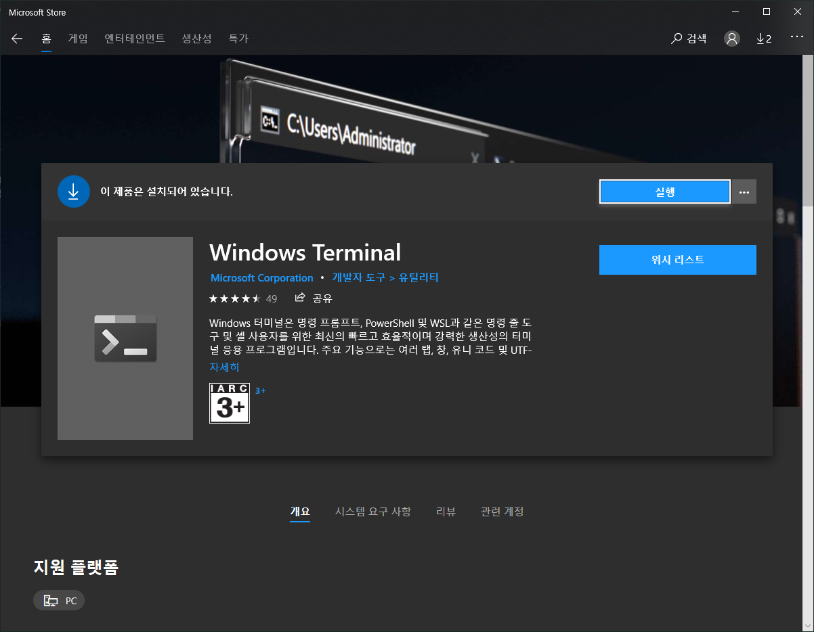
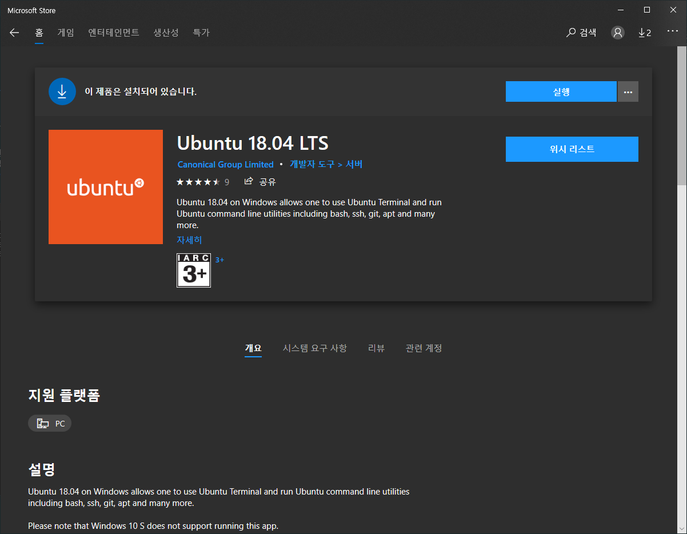
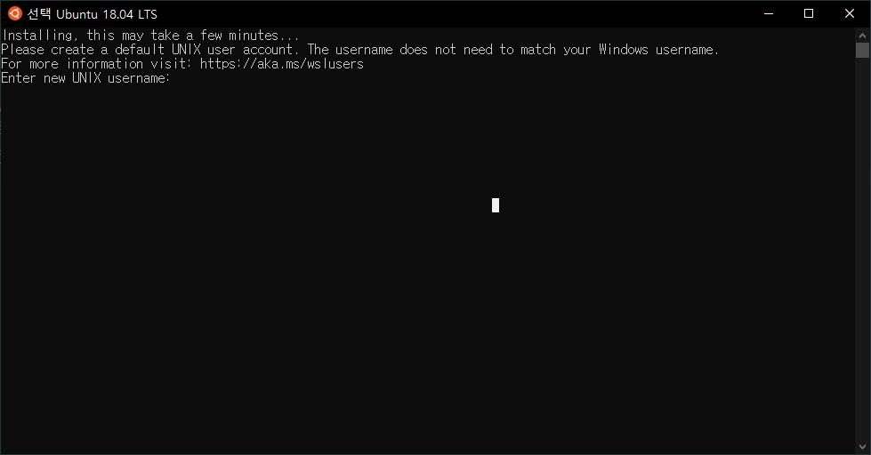

## 1. wsl 설치

```powershell
dism.exe /online /enable-feature /featurename:Microsoft-Windows-Subsystem-Linux /all /norestart
```

## 2. 윈도우 버전 업그레이드

[공식 홈페이지 참조](https://docs.microsoft.com/ko-kr/windows/wsl/install-win10)

```
WSL 2로 업데이트
WSL 2로 업데이트하려면 다음 조건을 충족해야 합니다.
Windows 10 실행, 버전 2004로 업데이트, 빌드 19041 이상.
Windows 로고 키 + R을 선택하고 winver를 입력한 다음, 확인을 선택하여 Windows 버전을 확인합니다.
(또는 Windows 명령 프롬프트에서 ver 명령을 입력합니다.)
빌드가 19041보다 낮은 경우 최신 Windows 버전으로 업데이트합니다. Windows 업데이트 도우미를 가져옵니다.
```

## 3. 가상 머신 사용 설정

```powershell
dism.exe /online /enable-feature /featurename:VirtualMachinePlatform /all /norestart # 재시작 필요
```

위에 wsl 버전 설정이 있는데 버전 설정은 우분투 깔고 해야 제대로 동작한다.

## 4. 우분투 및 windows terminal 설치

기본 버전을 wsl2로 변경
안되면 powershell에서 winver로 버전 확인해보고
`Windows 10 실행, 버전 2004로 업데이트, 빌드 19041 이상.`인지 확인한다.

```powershell
wsl --set-default-version 2
```

오류: 0x1bc 해결 방법
<https://docs.microsoft.com/ko-kr/windows/wsl/wsl2-kernel>
해당 업데이트 설치



윈도우 터미널 설치

실행 버튼 누르고 업데이트

unix 아이디 비번 설정

여기까지 하면 설정 끝.

## 추가로 하면 좋은 작업

리눅스 배쉬를 커스텀 터미널로 바꾸자.

1. oh my zsh
   <https://github.com/ohmyzsh/ohmyzsh>

```shell
curl -Lo install.sh https://raw.githubusercontent.com/ohmyzsh/ohmyzsh/master/tools/install.sh
sudo apt install zsh
sh install.sh
```

2. <https://terminalsplash.com/>
   디자인 변경
   
   scheme에 코드 추가
   
   사용할 쉘에 삽입
   default는 모든 쉘
3. powerlevel10k
   <https://github.com/romkatv/powerlevel10k>

```shell
git clone --depth=1 https://github.com/romkatv/powerlevel10k.git ${ZSH_CUSTOM:-$HOME/.oh-my-zsh/custom}/themes/powerlevel10k
```

Set ZSH_THEME="powerlevel10k/powerlevel10k" in ~/.zshrc.


쉘 재시작

아마 폰트가 깨질꺼임.

MesloLGS NF 폰트를 <https://github.com/romkatv/powerlevel10k>
중간에서 찾아서 다운로드 (4개 전부)


쉘 세팅에서 폰트 바꿔줌

마지막으로 vscode 폰트 설정.


설정은 본인 취향! (마지막만 3)


integrated Terminal


이제 진짜 끝!

ps : 설정 다시 바꾸고 싶으면 p10k configure

### Linuxbrew 도입하기

공식 사이트에 나와 있는대로 설치하면 좋다

```shell
$ sh -c "$(curl -fsSL https://raw.githubusercontent.com/Linuxbrew/install/master/install.sh)"
# 만약 Warning: /home/linuxbrew/.linuxbrew/bin is not in your PATH. 라는 경고 메시자가 나왔다면 아래를 ~/.bashrc 에 추가

test -d ~/.linuxbrew && eval $(~/.linuxbrew/bin/brew shellenv)
test -d /home/linuxbrew/.linuxbrew && eval $(/home/linuxbrew/.linuxbrew/bin/brew shellenv)
test -r ~/.bash_profile && echo "eval \$($(brew --prefix)/bin/brew shellenv)" >>~/.bash_profile
echo "eval \$($(brew --prefix)/bin/brew shellenv)" >>~/.profile
source ~/.bashrc # 하여 WSL 재시작 하고, .bashrc 파일을 로딩 했다면 brew 명령어를 사용할 수 있게 되었으므로 공식 사이트처럼 Hello World를 설치해 본다.
```

Zsh 로 기본쉘로 적용하고 나서는 ~/.bash_profile 대신에 ~/.zshrc 를 사용하게 됩니다.  
즉, 기존의 bash 쉘을 사용할때는 ~/.bash_profile 에 설정값을 저장하는데, zsh 를 사용하면 ~/.zshrc 에 설정해야 합니다.  

ex) jenv/bin 을 패스에 추가하기  

```shell
echo 'export PATH="$HOME/.jenv/bin:$PATH"' >> ~/.zshrc
```
