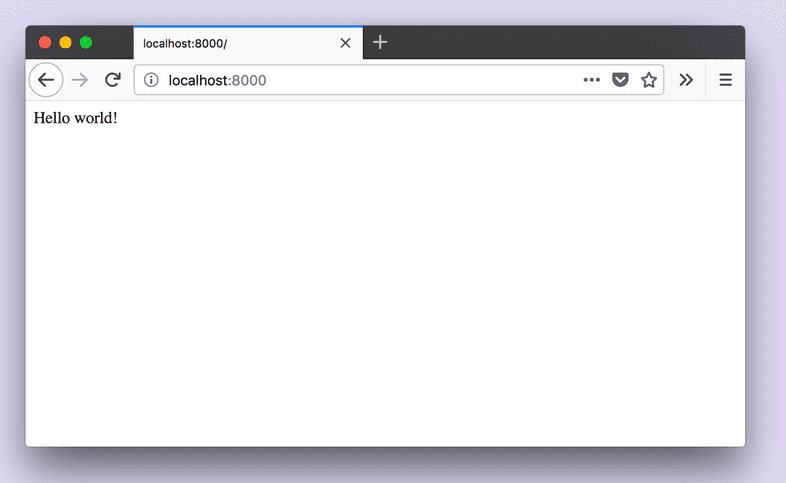

[원문](https://www.gatsbyjs.com/tutorial/part-zero/)
목표 :
핵심 웹 기술 숙지 및 필요한 소프트웨어 설치

1. 명령줄(CLI)에 익숙해지기
커맨드라인은 컴퓨터에서 명령을 실행하기 위한 텍스트 기반 인터페이스.
종종 터미널이라고 함.
Finder, Explorer는 GUI임

2. Node.js 설치

OS에 맞게 Node.js를 설치한다.

### 맥 OS:
1. 홈브루를 설치한다.
```SHELL
# 설치 확인
brew -v
```
2.  Xcode 커맨드라인 툴 설치
```SHELL
xcode-select --install
```
3. Node 설치
```SHELL
# 설치 확인
brew install node
```
홈브루를 쓰기 싫으면 알아서 깔자 -_- (난 맥이 없음)

### 윈도우:
https://nodejs.org/en/
공식 홈페이지 가서 깔자...

### Linux
여러 배포판 존재, 여기선 우분투만 설명
```SHELL
# 업그레이드 및 업데이트 실행 준비 확인
sudo apt update
sudo apt -y upgrade
# 데이터 전송 및 추가 종속성 다운로드 위함.
sudo apt-get install curl
# NVM 최신 버전 설치
curl -o- https://raw.githubusercontent.com/nvm-sh/nvm/v0.35.1/install.sh | bash
# NVM 버전 확인
nvm --version
# 버전 세팅. 최신 버전 써도 상관은 없음
nvm install 10
nvm use 10
# 버전 확인
npm --version
node --version
```

### git
starter 탬플릿을 받아서 쓰려면 설치해야함
Install Git on macOS : https://www.atlassian.com/git/tutorials/install-git#mac-os-x
Install Git on Windows : https://www.atlassian.com/git/tutorials/install-git#windows
Install Git on Linux : https://www.atlassian.com/git/tutorials/install-git#linux

### (드디어) Gatsby CLI 설치
Gatsby 기반 사이트를 빠르게 만들고 개발용 명령어 실행 가능
npm package로 배포됨
```shell
# 전역 설치
npm install -g gatsby-cli

# 설치 확인
gatsby --help

# 설치 잘 안되면 sudo 쓰기
```

### Gatsby site 만들기
지금까지 설치한 소프트웨어로 starter Gatsby 사이트 깃에서 받아오기
```shell
gatsby new hello-world https://github.com/gatsbyjs/gatsby-starter-hello-world
```
무슨 일이 일어날까?

```
1. new는 새 Gatsby 프로젝트 생성 명령어
2. hello-world는 내가 정하고 싶은 폴더(프로젝트) 이름. 
해당 폴더에 프로젝트 파일들 배치함
3. url 깃헙 저장소에서 clone해옴
```
```shell
# 해당 저장소로 이동하자.
cd hello-world
# 로컬에서 개발 서버 실행
gatsby develop
```
http://localhost:8000/ 들어가서 결과 확인! 
   

프로세스 중지는 ctrl + c
``` 
Note: If you are using VM setup like vagrant and/or would like to listen on your local IP address, run gatsby develop --host=0.0.0.0. Now, the development server listens on both http://localhost and your local IP.
```
추가로 할 일 :
vs코드 에디터 깔기
vs코드 Prettier 플러그인 깔기

앞으로는 Gatsby에 집중하기 위해 다른 소프트웨어 설명은 최대한 줄이겠음.

갯츠비 핵심 기술 :
1. HTML : 웹 페이지(콘텐츠)의 구조 정의
2. CSS :  웹 콘텐츠 (글꼴, 색상, 레이아웃) 모양 지정
3. JavaScript : 인터랙티브 웹 기능 개발 언어
4. React : 자바스크립트 라이브러리. 콘텐츠 구조화에 사용.
5. GraphQL : Gatsby가 사이트 데이터 관리에 사용하는 쿼리 언어.

참고 자료 :
깃 핸드북 : https://guides.github.com/introduction/git-handbook/