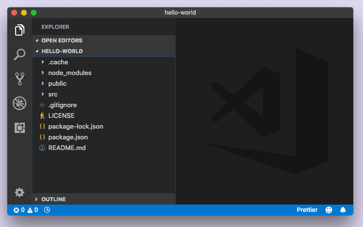
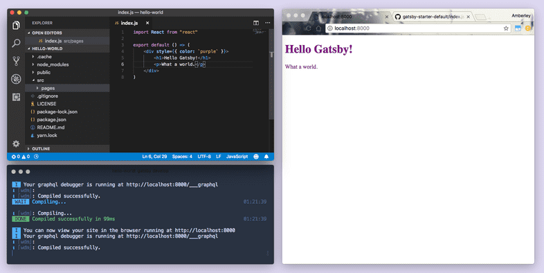
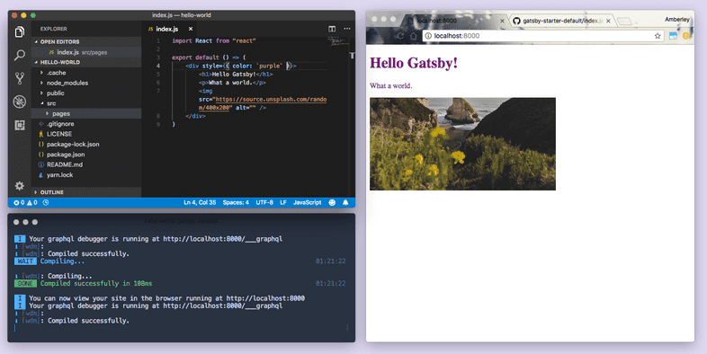
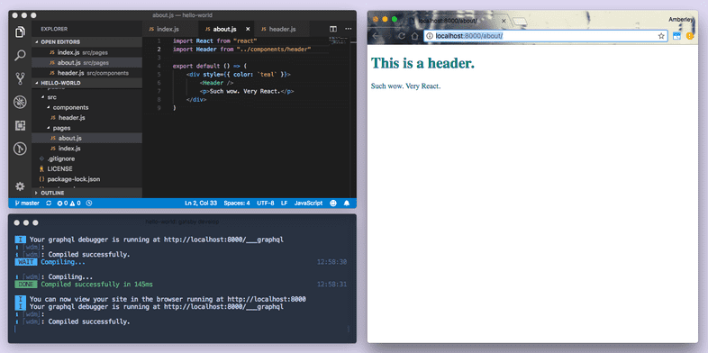
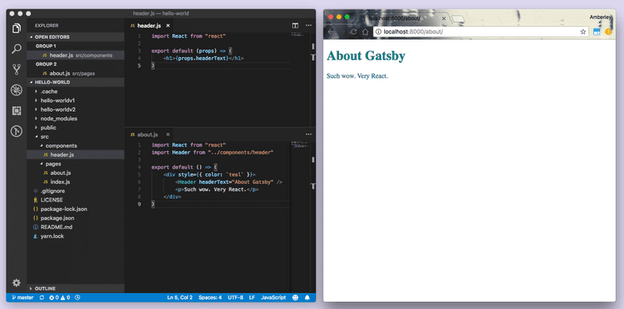

지난 시간에 한 일 :
hello world 스타터를 이용해 첫번째 사이트 제작.
로컬 개발 환경 준비

```shell
gatsby new hello-world https://github.com/gatsbyjs/gatsby-starter-hello-world
# or
gatsby new [SITE_DIRECTORY_NAME] [URL_OF_STARTER_GITHUB_REPO]
# URL이 없으면 default starter 만들어줌.
```

### VSCODE로 환경 살펴보기

  
폴더를 열어서 보자.

```
gatsby develop으로 로컬 개발 서버를 켜두는걸 잊지 말자.
```

`/src` 디렉토리를 열어보면 `/pages`라는 하나의 디렉토리가 보인다.
`src/pages/index.js` 파일을 열어보자.
이 파일의 코드가 단일 dev 컴포넌트와 문구를 만든다.
문구를 한번 수정해보자.

```
gatsby는 hot reloading을 지원한다.
```

해당 파일의 코드를 바꿔보자

```jsx
import React from "react"
export default function Home() {
  return <div style={{ color: `purple`, fontSize: `72px` }}>Hello Gatsby!</div>
}
```

// or

```jsx
export default function Home() {
  return (
    <div style={{ color: `purple` }}>
      <h1>Hello Gatsby!</h1>
      <p>What a world.</p>
    </div>
  )
}
```



```jsx
import React from "react"
export default function Home() {
  return (
    <div style={{ color: `purple` }}>
      <h1>Hello Gatsby!</h1>
      <p>What a world.</p>
      
    </div>
  )
}
```



### 잠깐... 자바스크립트 안에 HTML?

JSX라는 React용 JavaScript 구문 확장임.

```JSX
// 이 두개는 동일

import React from "react"
export default function Home() {
  return <div>Hello world!</div>
}
import React from "react"
export default function Home() {
  return React.createElement("div", null, "Hello world!");
}
```

Gatsby 플러그인이 알아서 JSX를 js, html로 변환해줌.

### Components로 빌드.

방금 우리는 컴포넌트로 구성요소를 정의해 홈페이지를 만들었다.
컴포넌트가 뭐지?
애매하지만, UI 섹션 코드 조각이라고 하자.
컴포넌트 사용 및 정의는 React Component를 의미한다.
이 컴포넌트는 입출력이 가능하다.

구성 요소 빌드의 핵심은,
한 파일 내애 CSS, HTML, JS가 밀접하게 공존한다는 것이다.

```jsx
// 두개는 동일
<button class="primary-button">Click me</button>
<PrimaryButton>Click me</PrimaryButton>
```

`src/pages/about.js` 파일을 만들자.

```JSX
import React from "react"

export default function About() {
  return (
    <div style={{ color: `teal` }}>
      <h1>About Gatsby</h1>
      <p>Such wow. Very React.</p>
    </div>
  )
}
```


### 하위 구성요소 활용

UI를 재사용 가능한 구성요소로 쪼갤 수 있다.
header와 footer를 만들어보자.

```jsx
// src/components/header.js
import React from "react"

export default function Header() {
  return <h1>This is a header.</h1>
}
```

```jsx
//src/pages/about.js
import React from "react"
import Header from "../components/header"
export default function About() {
  return (
    <div style={{ color: `teal` }}>
      <Header />
      <p>Such wow. Very React.</p>
    </div>
  )
}
```



헤더를 이렇게 바꿔보자

```jsx
// src/components/header.js
import React from "react"
export default function Header(props) {
  return <h1>{props.headerText}</h1>
}
```



### 잠깐. props가 뭐임?

재사용 가능한 조각의 동적 제작을 위해
다른 데이터를 제공할 수 있어야 한다. (ex 문구)
각 React Component에 적합하게 제공되는 속성이다.

해당 컴포넌트를 사용하는 곳에서 props 재정의가 가능하다.

```jsx
import React from "react"
import Header from "../components/header"
// 임의로 내가 정할 수 있다!
export default function About() {
  return (
    <div style={{ color: `teal` }}>
      <Header headerText="About Gatsby" />
      <Header headerText="It's pretty cool" />
      <p>Such wow. Very React.</p>
    </div>
  )
}
```

### 레이아웃 컴포넌트

[파트 3](https://www.gatsbyjs.com/tutorial/part-three/)에서 공부할 것이다.
여러 페이지에서 공유하는 사이트 섹션을 위한 것이다.
ex) 사이드바, 네비게이션, 헤더, 푸터

인덱스 페이지를 바꿔보자
`src/pages/index.js`

```jsx
import React from "react"
import { Link } from "gatsby"
import Header from "../components/header"

export default function Home() {
  return (
    <div style={{ color: `purple` }}>
      <Link to="/contact/">Contact</Link>
      <Header headerText="Hello Gatsby!" />
      <p>What a world.</p>
      
    </div>
  )
}
```

contact 버튼을 누르면
  
없는 링크를 걸었기에 해당 창이 뜬다.
`src/pages/contact.js`

```jsx
import React from "react"
import { Link } from "gatsby"
import Header from "../components/header"
export default function Contact() {
  return (
    <div style={{ color: `teal` }}>
      <Link to="/">Home</Link>
      <Header headerText="Contact" />
      <p>Send us a message!</p>
    </div>
  )
}
```

이제 링크를 따라가보자!

```
<Link /> 구성요소는 사이트 내의 페이지 링크를 위한 것.
외부 링크는 HTML <a> 태그 사용.
```

원문에는 surge와 gatsby cloud를 이용한 배포가 있지만, 다들 잘 안쓰는 방법이라 생략.
