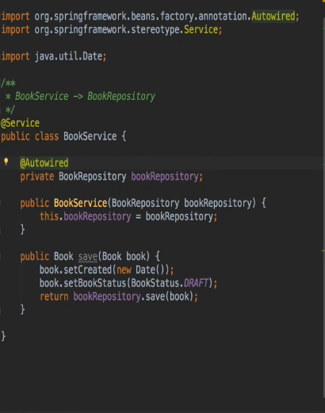
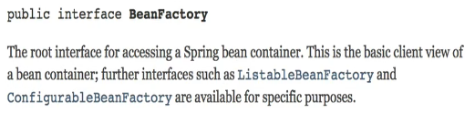
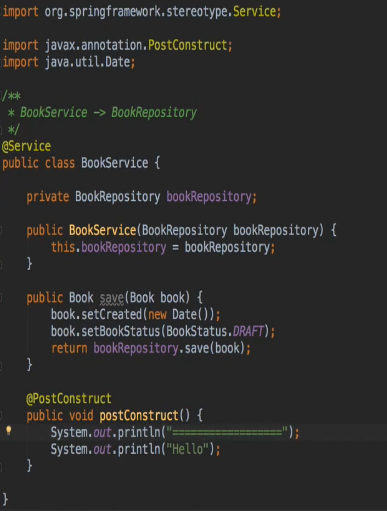
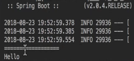
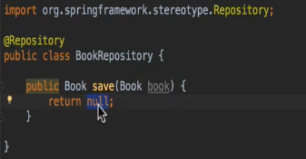
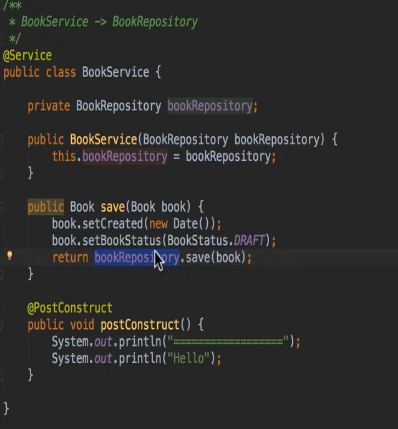
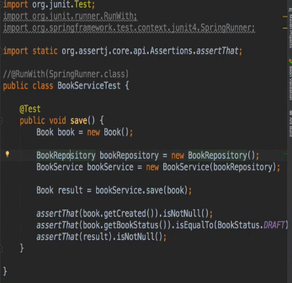
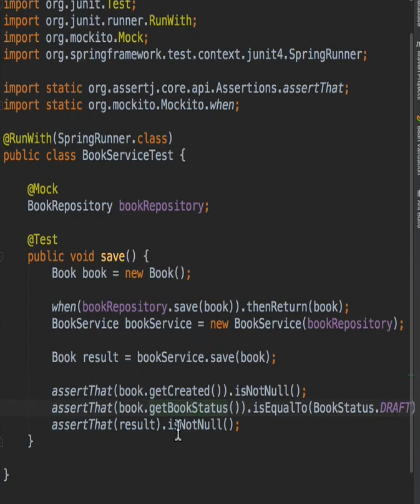
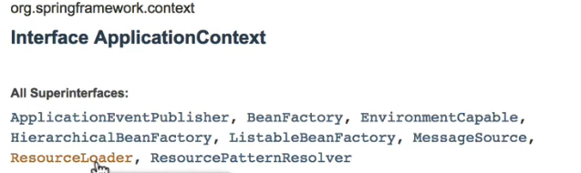

- 의존 관계 주입
    객체가 사용하는 객체를 new 생성 않고
    `생성자`를 통해 주입 받아 사용 (여러 방법이 있지만 BP인 생성자로 쓰자.)
- IOC를 쓰는 이유 : 스프링은 여러 DI 방법과 노하우가 쌓여있는 F/W (BP)
    초기에는 XML 기반 -> Google Guice가 선보인 @annotation 기반
    `@Autowired` 통해 빈에 등록된 객체를 주입받아 사용

BeanFactory 인터페이스가 스프링 IOC의 가창 최상위 인터페이스

### 숙제 
빈팩토리 라이프사이클을 한번 확인해보자.

### 빈
- Spring IOC 컨테이너가 관리하는 객체
    @Repository
    @Service
    @Controller
    @Model

- 왜 빈으로 등록하는가?
  - 의존성 주입
  - 빈의 스코프
    - 싱글톤 (하나만 만들어 사용)
      - 프로토타입 (매번 다른 객체)
    - 라이프사이클 인터페이스 (빈의 생명 주기에 따른 다양한 작업 가능)
        애플리케이션 전체에서 객체의 사용을 관리해준다.
        매번 만들어 사용하는 것보다 성능 관리 유리!

라이프사이클 출력 설정

라이프사이클 출력 결과

### 또 다른 장점 - 테스트

우리는 북레포 구현 없이 북서비스 테스트가 불가능

세이브가 널을 리턴하니까...

save가 null을 return하기 때문에 테스트 불가능.
- 가짜 객체를 만들어 의존성을 주입할 수 있다.

mockito 라이브러리 참고

또하나의 IOC 컨테이너의 중요한 인터페이스
Application Context

빈팩토리를 상속받아 아래 기능 구현 (뒤에 살펴봄)
EventPublisher
EnvironmentCapable 
MessageSource Internationalization 메세지 다국화 (영어 <-> 한국어)
ResourceLoader 어딘가에 있는 자료 읽어옴 (파일, 웹)